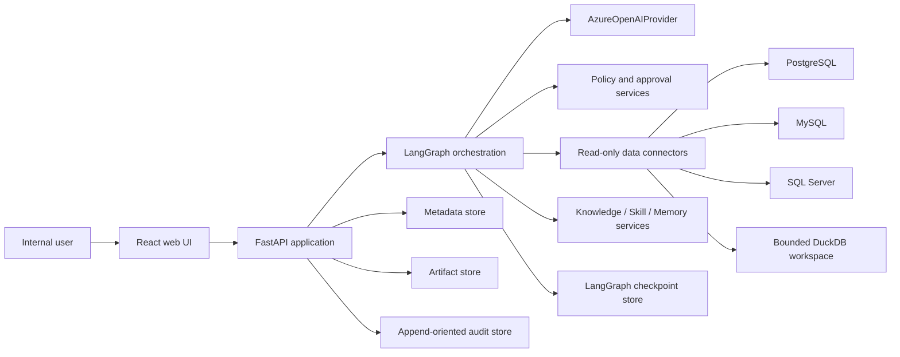
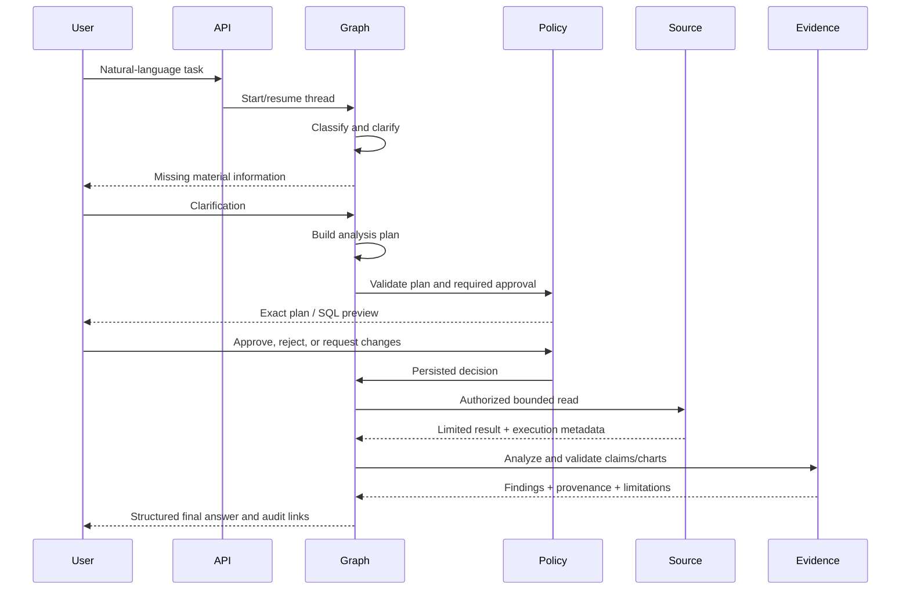

# System Architecture

## Decision summary

Use a modular monolith for the MVP: a React web application, a FastAPI backend, one explicitly modeled LangGraph application, and storage/provider/connector interfaces. This keeps deployment simple while isolating boundaries that may later scale independently.

The model proposes and interprets; deterministic code authorizes, validates, executes, and records.

## Context

External systems do not trust model output directly. All arrows that can read sensitive data or cause a side effect cross deterministic authorization, validation, limit, and audit controls.

## Logical modules

| Module | Responsibilities | Must not own |
|---|---|---|
| `conversation` | Sessions, messages, streaming events, user clarification | SQL execution or durable Knowledge |
| `orchestration` | Typed state, graph nodes/edges, interrupts, bounded retry | Provider-specific SDK behavior |
| `llm` | Model profiles, Azure client adapter, structured output, usage | Business policy decisions |
| `planning` | Goal, metric, time/source/dimension/output completeness | Authorization |
| `data_access` | Connector registry, schema catalog, query execution | Arbitrary credentials or writes |
| `sql_policy` | AST validation, allowlists/denylists, limits, approval binding | Model-driven exceptions |
| `analysis` | Controlled functions, DuckDB joins, statistics, charts | Unrestricted Python/shell |
| `evidence` | Provenance, calculations, labels, citations | Hidden chain-of-thought |
| `knowledge` | Documents, chunks, retrieval, proposals | Silent activation |
| `jobs` | Phase 4 job state, retry, cancellation, timeout | Invisible/unbounded loops |
| `notifications` | Phase 5 channel interface and exact-payload approval | Core analytical runtime |
| `governance` | Policy, approvals, audit, retention, redaction | Business analysis |

## Logical agent roles

- **Coordinator**: conversation, clarification, task goal, plan, route, approval coordination, final synthesis.
- **Data Analyst**: source selection, query proposal, controlled analysis, chart proposal, evidence-linked conclusions.
- **Knowledge Curator**: document parsing, provenance, retrieval, and Knowledge/Skill/Memory proposals.
- **Data Reliability**: Phase 4 only; data-quality and Jira-based recovery planning.

Roles are stable subgraphs or prompt/model profiles, not independent autonomous services. Deterministic nodes remain outside model authority.

## Runtime sequence

## Provider architecture

Business code depends on an internal `LLMProvider` protocol. `AzureOpenAIProvider` is the adapter for the official OpenAI Python SDK configured for Azure; `MockLLMProvider` supplies deterministic fixtures.

Required provider operations:

- `generate_structured(profile, request, schema)`
- `stream(profile, request)`
- `invoke_tools(profile, request, tool_contracts)`
- standardized timeout/retry/error/usage/request-ID metadata

`ModelProfile` maps each logical role to an Azure **deployment name**, reasoning/response settings, tool allowlist, timeout, retry, and token budget. Endpoint, API version, authentication mode, key/token provider, and embedding deployment are environment/configuration values. Provider capability checks occur at startup because Azure region, API version, and deployment features can differ.

The OpenAI SDK is permitted only inside the adapter. Azure response/type differences are normalized into internal models so SDK response types never cross the provider boundary.

## Data access

Each `DataSourceConfig` contains logical name, dialect, secret reference, allowed schemas/tables/views, denied/sensitive columns, timeout, max rows/bytes, timezone, and immutable read-only mode.

For cross-source analysis:

1. Validate and run a bounded query independently at each source.
2. Persist execution metadata; keep result artifacts ephemeral and access-controlled.
3. Load only bounded results into an isolated DuckDB workspace.
4. Join using explicit keys, normalization, and duplicate/cardinality checks.
5. Destroy the workspace according to retention policy.

Large cross-source joins require a revised plan and human approval; there is no assumed federated SQL.

## Storage boundaries

- **Metadata store**: sessions, tasks, plans, approvals, configurations, document metadata, proposals, jobs.
- **Checkpoint store**: resumable LangGraph execution state only.
- **Artifact store**: uploads, bounded query results, tables, charts, and reports with classification/retention.
- **Audit store**: append-oriented security and execution events.
- **Knowledge store**: Phase 3 search index plus authoritative source/proposal records.

Separate interfaces allow local SQLite/filesystem implementations and later PostgreSQL/object-storage/search implementations. Storage migration must not change domain contracts.

## Frontend

The first UI is a clean single-chat workspace with session list, file upload, streaming response, status, plan, SQL preview, approve/reject/request-changes, table/chart, evidence panel, trace/error summary, and Skill/Memory proposal diff. Agent roles stay behind the interface; a development-only debug panel may show routing.

## Deployment evolution

- Local MVP: web + API processes, SQLite stores, local artifacts, mock sources/provider.
- Internal pilot: managed relational metadata/checkpoints, approved artifact storage, Entra ID, network controls, centralized telemetry.
- Production: independently scalable API/workers only when measurements justify separation. No Kubernetes assumption.

## Architecture decision records to add

- ADR-001 dataframe choice after Phase 2 spike
- ADR-002 identity/auth integration
- ADR-003 production metadata/checkpoint stores
- ADR-004 Knowledge retrieval backend
- ADR-005 job runner/queue
- ADR-006 Teams integration approach
