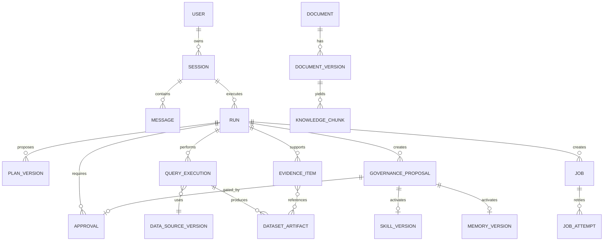

# Data Model

## Modeling rules

- UUID/ULID identifiers are opaque; timestamps are UTC with explicit source timezone metadata where relevant.
- Mutable records use optimistic versioning; governed objects use immutable versions plus lifecycle status.
- Secrets are references, never values.
- Large/sensitive content lives in protected artifact storage; tables keep references, hashes, sizes, classifications, and retention metadata.
- Audit is append-oriented and logically separate from application records.

## Core relationships

## Principal records

### Conversation and execution

- `users`: external identity subject, display metadata, status; no password store in MVP.
- `sessions`: owner, title, classification, created/updated/retention dates.
- `messages`: session, role, bounded content/artifact references, created time, safety metadata.
- `runs`: session, graph/state schema version, status, route, started/ended, cancellation/deadline, final answer reference.
- `plan_versions`: run, version, canonical plan JSON, payload hash, status, created_by, supersedes.
- `approvals`: run, action type, object/payload hash, policy version, requester, approver, decision, comment, expiry, decision time, supersedes.

### Data access and analysis

- `data_sources` / `data_source_versions`: logical name, dialect, owner, secret reference, allowed/denied policy, limits, timezone, read-only verification, effective dates/status.
- `query_proposals`: run, source version, dialect, normalized SQL, protected/redacted parameters, validation result, plan/approval references.
- `query_executions`: proposal, status, start/end, row/byte counts, source request ID, error category, result artifact, SQL/policy hashes.
- `dataset_artifacts`: protected URI/reference, content/schema hash, classification, source lineage, row/byte count, created/expiry/deleted times.
- `analysis_steps`: run, operation/version, input/output artifact references, parameters, calculation hash, status.
- `chart_artifacts`: run, validated Plotly JSON reference, source dataset, title/metric/time/unit/notes, schema version.
- `evidence_items`: run, claim ID, source/query/document refs, filters/fields/calculation, support artifact, confidence, evidence label, limitations.

### Documents and governance

- `documents`: stable logical document, owner, classification, status.
- `document_versions`: document, version, source artifact/hash, effective date, uploader, scanner/parser versions/status.
- `knowledge_chunks`: document version, page/sheet/section, chunk ID/hash, content/protected reference, index status.
- `governance_proposals`: kind (`knowledge`, `skill`, `memory`), target, base/new version, diff reference, rationale, source references, status, creator, approval.
- `skill_versions`: skill name/version, Git commit/path, status, change summary, tests, activated/deprecated times and actors.
- `memory_versions`: memory type/key, protected structured value/reference, source, created/approved by, effective/expiry, status, supersedes.

### Jobs, notification, and audit

- `jobs`: type, run, canonical payload hash/reference, status, schedule/deadline, approval, cancellation, retry policy.
- `job_attempts`: job, attempt, worker, start/end, status/error, checkpoint/output references.
- `notification_deliveries`: Phase 5 channel, exact recipient/payload/artifact hash, approval, delivery status/provider receipt.
- `audit_events`: event ID/time, actor/session/run/node/role, action/resource, tool/input hash, policy/prompt/deployment versions, status, safe metrics, correlation IDs, integrity metadata.

## State machines

### Run

`created -> planning -> waiting_input | waiting_approval | running -> completed | failed | cancelled | timed_out`

### Approval

`pending -> approved | rejected | changes_requested | expired | superseded`

### Governance proposal

`draft -> pending_approval -> active | rejected | withdrawn`; an active version may become `deprecated` or `superseded`.

### Job

`queued -> planning -> waiting_approval -> running -> completed | failed | cancelled | timed_out`

Transitions are validated in domain services, written transactionally with outbox/audit intent where needed, and protected by idempotency/version checks.

## Checkpoint separation

The LangGraph checkpoint store may contain IDs pointing to these records but is not joined as an authoritative domain table. Deleting/replaying/forking a checkpoint cannot silently alter approvals, active Skills, long-term Memory, Knowledge versions, jobs, or audit.

## Local and production mapping

Phase 1 uses SQLAlchemy repository interfaces with SQLite-compatible schemas. Production migration to PostgreSQL must preserve domain IDs and semantics. Artifact bytes remain outside relational rows. Vector/search indexes in Phase 3 are rebuildable projections from authoritative document/chunk records.
