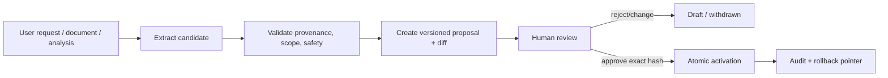

# Knowledge, Skill, and Memory

## Separation of concerns

| Concept | Purpose | Authoritative representation | Activation rule |
|---|---|---|---|
| Knowledge | Sourced facts, definitions, rules, and context | Versioned document/chunk records with provenance | Approved ingestion/publication policy |
| Skill | Versioned method for completing a class of tasks | Git-tracked directory and metadata | Explicit approval and tests |
| Memory | Approved long-lived project/user/entity context | Versioned structured record with source and expiry | Explicit approval |
| Session state | Current conversation/run continuity | Session records + LangGraph checkpoint | Runtime lifecycle only |

No category silently converts into another.

## Knowledge

Required provenance includes `document_id`, version, source file/hash, page/sheet/section, chunk ID, effective date, owner, confidence, classification, parser version, and status. Retrieval filters by access, status, effective time, classification, and source ownership before semantic/keyword ranking.

Answers cite source locations. Conflicting sources are surfaced with version/effective-date/owner context; the model does not pick an authoritative definition without policy or owner confirmation. No reliable source means `Unknown`.

## Skill

```text
skills/<skill_name>/
├── SKILL.md
├── metadata.yaml
├── examples/
├── tests/
├── queries/
└── scripts/
```

`metadata.yaml` will include name, semantic version, status (`draft`, `active`, `deprecated`), owner, purpose, input/output contracts, required permissions, source/proposal references, compatible product version, changelog, approval, and rollback version.

Natural-language teaching produces a proposal and diff only. Activation requires:

1. provenance and permission validation
2. content and prompt-injection review
3. at least one positive test plus safety/negative tests
4. dependency/query/script review
5. owner approval bound to the commit/diff hash
6. atomic activation with audit and rollback pointer

Unapproved Skills are excluded from runtime discovery. Deprecation stops new selection while preserving historical reproducibility.

## Memory

- `session`: current conversation state; not long-term governance.
- `project`: approved project context shared within authorized scope.
- `user_preference`: approved durable preference; never inferred silently from sensitive behavior.
- `entity`: structured system, metric, owner, or business entity context.

Long-term Memory includes source, `created_by`, `approved_by`, `effective_at`, `expires_at`, status, classification, and superseded version. Never store secrets, credentials, raw sensitive datasets, private chain-of-thought, or unsupported conclusions.

Users can request proposal, review, correction, deletion, or expiry. Retrieval enforces identity/scope and tells the response when Memory materially influences it.

## Proposal workflow



Approval is checked outside the checkpoint. A replayed graph cannot activate the same proposal twice; activation is idempotent and version-checked.

## Retrieval and context assembly

Context assembly follows least privilege and token/data minimization:

1. authorize user and task purpose
2. retrieve active items within scope/effective dates
3. rank sources and remove duplicates
4. cap content and redact denied fields
5. include provenance beside each excerpt
6. mark source trust and prevent retrieved instructions from overriding system policy
7. audit IDs/hashes and selection rationale, not sensitive full context

## Evaluation

Phase 3 adds golden retrieval cases, citation accuracy, conflict/expiry handling, unauthorized retrieval, injection resistance, proposal non-activation, rollback, deletion propagation, and stale-index rebuild tests.
