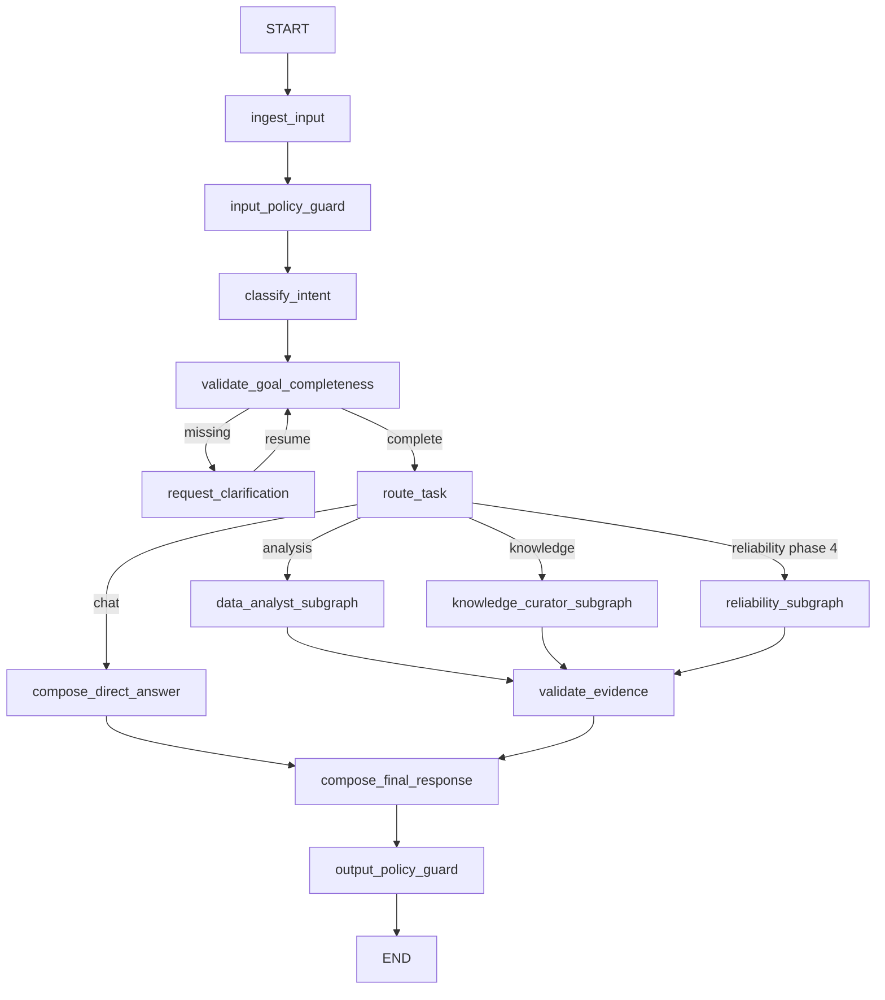
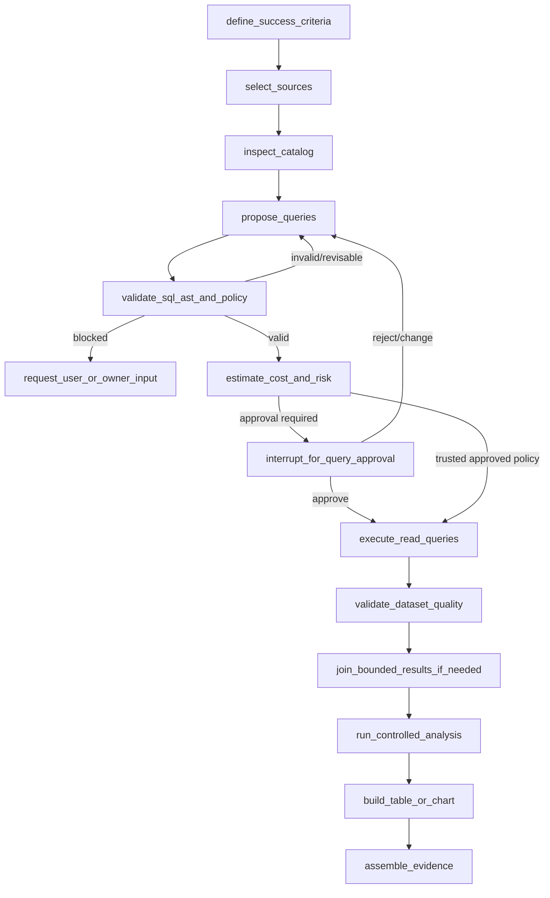

# LangGraph Design

## Boundary

LangGraph OSS provides typed shared state, nodes, conditional edges, subgraphs, streaming status, checkpointing, resumable execution, interrupts, and bounded retry routing. It does not own authoritative Knowledge, Skill, Memory, approval, audit, or job records.

The implementation will use the Graph API with explicit nodes and edges. A prebuilt ReAct agent is not the core runtime.

## Typed `AgentState`

The following is a design contract, not yet implemented:

```python
class AgentState(TypedDict, total=False):
    schema_version: str
    session_id: str
    run_id: str
    user_id: str
    task_id: str
    messages: list[MessageRef]
    goal: GoalSpec | None
    clarification: ClarificationState
    route: Literal["chat", "analysis", "knowledge", "reliability"]
    plan_ref: str | None
    selected_source_ids: list[str]
    query_proposal_refs: list[str]
    dataset_refs: list[str]
    analysis_result_refs: list[str]
    chart_refs: list[str]
    evidence_refs: list[str]
    proposal_refs: list[str]
    pending_approval_ref: str | None
    status: RunStatus
    retry: RetryState
    errors: list[SanitizedError]
    final_answer_ref: str | None
```

State holds identifiers and bounded orchestration values. Large messages, files, dataframes, query results, secrets, connection strings, raw source rows, full documents, and authoritative records stay outside the checkpoint.

## Top-level graph



## Node classification

| Node/category | Type | Reason |
|---|---|---|
| Input/output policy, identity, permission | Deterministic | Security invariant |
| Goal completeness | Hybrid: model extraction + deterministic required-field check | Language interpretation with explicit contract |
| Intent classification and plan proposal | Model-driven with schema validation | Semantic work |
| Route allowlist and phase gate | Deterministic | Prevent unavailable/unauthorized routes |
| Source discovery | Deterministic catalog + model ranking | Model cannot invent access |
| SQL proposal | Model-driven | Semantic translation |
| SQL AST/policy/limit validation | Deterministic | Security invariant |
| Approval requirement and payload binding | Deterministic | Authorization invariant |
| Query execution | Deterministic connector | No model authority |
| Statistical interpretation | Controlled functions + model explanation | Reproducible calculations |
| Plotly proposal | Model-driven with deterministic schema/content validation | Safe presentation |
| Evidence/claim validation | Deterministic linkage + model-assisted review | Provenance invariant |
| Final synthesis | Model-driven from validated references | User communication |

## Data Analyst subgraph



## Knowledge Curator subgraph

`validate_upload -> parse_document -> persist_source_metadata -> chunk_and_index -> retrieve -> extract_candidates -> create_proposal_diff -> interrupt_for_approval -> activate_or_reject`

Uploaded content never changes system instructions. Activation writes through an authoritative proposal service after approval; it does not mutate behavior from checkpoint state.

## Reliability subgraph (Phase 4)

`plan_jira_action -> [read | bounded_search | interrupt_for_exact_write_approval] -> execute_jira_action -> audit_result`

Jira reads and allowlist-bounded JQL searches execute directly. Issue creation and status transition require an authoritative exact-payload approval; missing action details or recovery criteria return to a human/owner.

## Conditional edges

Edges depend only on validated enums/records, never free-form model text:

- completeness: `missing | complete`
- route: `chat | analysis | knowledge | reliability | unsupported`
- validation: `valid | revise | blocked`
- approval: `not_required | waiting | approved | rejected | changes_requested | expired`
- execution: `success | transient_error | policy_error | user_fixable | fatal | cancelled | timed_out`
- evidence: `sufficient | limited | inconsistent`

## Interrupt points and approval flow

Interrupt when:

- Material task information is missing.
- SQL or cross-source execution requires approval.
- A large/costly/risky query plan exceeds policy.
- Knowledge, Skill, or Memory activation is proposed.
- A background job or external delivery is proposed.
- An owner decision such as Jira recovery criteria is absent.

Approval records contain approver identity, action type, canonical payload hash, policy version, created/decided/expiry times, decision, comment, and superseded approval. Resume code re-fetches the authoritative record and re-validates identity, expiry, payload hash, and current policy. A checkpoint value alone never authorizes execution.

## Checkpoint strategy

- Local MVP: `AsyncSqliteSaver` in a database separate from domain metadata.
- Production candidate: durable supported store selected by deployment review.
- Stable `thread_id` maps to a session/run cursor; internal run/task IDs remain explicit.
- Checkpoint after graph supersteps and before/at interrupts; store only JSON-safe bounded state.
- Encrypt storage at rest, restrict access, apply retention, and delete checkpoints without deleting authoritative audit.
- Version state schemas and provide forward migration or an explicit incompatible-run failure.

LangGraph documentation notes that resuming an interrupt restarts the interrupted node from its beginning. Therefore code before `interrupt()` must be side-effect free or idempotent, and external effects must occur in a subsequent node after authoritative approval validation.

## Retry strategy

- Provider/network/429/5xx: exponential backoff with jitter, maximum attempts from policy, deadline-aware.
- Invalid structured model output: one repair attempt with validation errors, then fail or ask user.
- SQL policy failure: no automatic execution retry; allow bounded proposal revision.
- Query transient error: retry only when connector classifies it safe and the operation is read-only/idempotent.
- Authentication/authorization/policy failure: never retry automatically.
- Node retries are recorded with category and sanitized detail.

## Resume semantics

1. Caller supplies the same thread ID plus a typed resume command.
2. API authenticates user and authorizes access to the session.
3. Runtime loads checkpoint and authoritative pending approval/clarification.
4. Runtime validates state schema, run status, expiry, policy version, and resume payload.
5. Interrupted node restarts; it performs no effect before the interrupt.
6. A deterministic post-resume node consumes the decision and advances through an explicit edge.

Duplicate resumes use an idempotency key and return the existing transition. Resume after cancellation, timeout, completion, or supersession is rejected.

## Error handling

Errors are classified as `user_input`, `policy`, `permission`, `validation`, `provider_transient`, `provider_fatal`, `source_transient`, `source_fatal`, `analysis`, `cancelled`, `timed_out`, or `internal`. User responses contain a safe summary, current state, and recovery action; detailed sanitized metadata goes to audit/telemetry. Secrets and sensitive rows never appear in error messages.

## State retention and prohibited checkpoint content

Checkpoint retention is shorter than business/audit retention and configurable. Do not place the following in checkpoints:

- Secrets, credentials, bearer tokens, connection strings, or raw auth claims
- Full uploads/documents or malware-unscanned content
- Dataframes, DuckDB files, bulk/raw query results, or sensitive row samples
- Authoritative Knowledge, active Skill content, long-term Memory, or approval decisions
- Raw tool payloads, private chain-of-thought, or unrestricted model context
- External action payloads containing sensitive data (store protected artifact reference + hash)

## Streaming

Expose typed events such as `run.started`, `node.started`, `clarification.required`, `plan.ready`, `approval.required`, `query.started`, `query.completed`, `analysis.progress`, `artifact.ready`, `run.completed`, and `run.failed`. Events contain stable IDs and safe metadata, not private reasoning.

## Sources

- [LangGraph overview](https://docs.langchain.com/oss/python/langgraph/overview)
- [Persistence and checkpoints](https://docs.langchain.com/oss/python/langgraph/persistence)
- [Interrupt and resume rules](https://docs.langchain.com/oss/python/langgraph/interrupts)
- [Subgraphs](https://docs.langchain.com/oss/python/langgraph/use-subgraphs)
## Bounded analysis loop

The analysis subgraph is now:

create plan -> SQL approval -> execute step -> review observation

The review has two explicit routes:

- finish -> finalize result -> END
- continue -> revise plan -> SQL approval -> execute next step

The typed state stores the iteration number, bounded step snapshots, observations, and learning candidates. The review model may propose only a natural-language next analytical question. SQL is still compiled by the planner and passes connector, metadata, AST, policy, limit, and exact-approval checks before execution. The default maximum is three iterations and is configurable from one to eight.

Model-generated Python is a separate optional tool path. The API process never evaluates it. When enabled, the tool runs a strict program contract inside a disposable no-network Docker container and returns only bounded JSON rows.
