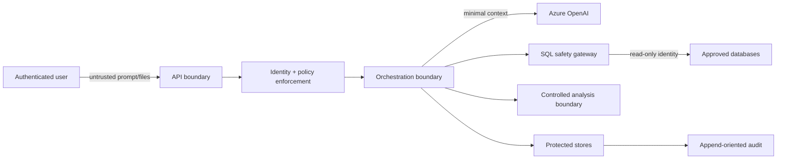

# Security Model

## Security objectives

1. Prevent unauthorized data access and all unintended writes.
2. Treat model, user, document, database, and tool content as untrusted.
3. Bind every privileged action to authenticated identity, policy, approval, and exact payload.
4. Minimize sensitive data sent to models, stored in artifacts, or exposed in logs.
5. Preserve auditable evidence without exposing private chain-of-thought.

## Trust boundaries

Trust is not inherited across boundaries. Each request is authenticated, authorized, validated, constrained, and audited at the component performing the operation.

## Threats and controls

| Threat | Primary controls |
|---|---|
| Prompt injection in uploads/tool output | Mark content as data, instruction hierarchy, isolate retrieval, tool allowlists, deterministic authorization, output validation |
| SQL injection or model-proposed writes | SQLGlot AST validation, SELECT/read-only CTE allowlist, deny DDL/DML/admin nodes, parameterization, database read-only identity |
| Excessive data extraction | Schema/table allowlist, denied columns, purpose check, row/byte/time caps, aggregation preference, approval, audit |
| Cross-source data leakage | Per-source policy, bounded artifacts, classification compatibility check, protected DuckDB workspace, deletion |
| Unauthorized approval/resume | Session authorization, exact payload hash, expiry, policy version, idempotency, authoritative decision lookup |
| Secret exposure | Secret references, managed identity preference, redaction, no checkpoint/log/model inclusion, rotation |
| Arbitrary code execution | Controlled function library first; isolated no-network subprocess/container only after verified sandbox |
| Malicious documents | Type/size validation, quarantine, malware scan, safe parsers, no macros, parser resource limits |
| Sensitive chart/table output | Field/classification policy, minimum aggregation, masking, artifact authorization, output guard |
| Supply-chain compromise | Lockfiles, integrity, SBOM, license/security scan, minimal dependencies, trusted registries |
| Denial of service/cost abuse | quotas, concurrency limits, timeouts, token/query budgets, cancellation, bounded retries |
| Audit tampering | append-oriented restricted writer, integrity metadata, central export, retention/legal hold |

## Identity and authorization

- Phase 1 may use an explicitly documented development identity only; production requires an approved enterprise identity integration.
- Authorization is server-side and evaluates user, role/group, purpose, source, action, classification, environment, and policy version.
- Data-source credentials are service identities scoped read-only; authorization does not rely on hiding UI controls.
- `trusted_readonly` is disabled by default and requires administrator configuration. It may waive interactive SQL approval only within unchanged policy limits; it never permits writes or denied data.
- Approval cannot grant access the approver or service did not already possess.

## Azure OpenAI

- Prefer Entra ID/managed identity; API keys are limited to approved development use.
- Keep endpoint, deployment names, API version, and auth outside code.
- Send the minimum necessary, classified and redacted context.
- Do not send secrets, connection strings, raw auth claims, or unbounded raw datasets.
- Configure approved regional endpoint, data handling, content logging, egress, quota, and retention before real use.
- Treat structured output and tool calls as untrusted input requiring schema/policy validation.
- Record safe request ID, deployment profile, template version, usage, status, and timing; do not log raw sensitive prompts by default.

## SQL safety gateway

The gateway performs, in order:

1. Resolve an approved logical data source and server-held secret reference.
2. Parse a single statement using the configured dialect.
3. Require `SELECT` or read-only CTE semantics; reject DML, DDL, transaction, procedure, copy/export, admin, and multi-statement forms.
4. Resolve referenced schemas/tables/views against allowlists.
5. Reject denied/sensitive columns including wildcard expansion that could include them.
6. Require parameterization for user-derived values.
7. Apply row limit, timeout, result-byte cap, and optional cost/EXPLAIN policy.
8. Bind normalized SQL, parameters, source, limits, and policy version to approval.
9. Revalidate immediately before execution.
10. Execute with a genuinely read-only database account and server/session read-only settings where supported.
11. Audit SQL hash/text according to classification, parameters in redacted form, timing, row count, bytes, and error category.

String matching alone is never the safety control.

For the local Super Agent UAT pilot only, `AMA_SUPER_AGENT_UAT_ALLOW_DETAIL_FIELDS=true` records the owner-approved assertion that stored PII fields are encrypted or tokenized. In development this clears field-level deny and aggregate-only sets for the three configured UAT tables. It does not allow wildcard SQL, decryption, writes, non-allowlisted tables, approval bypass, or results beyond the configured row, byte, and timeout caps; production startup rejects this switch.

## Python analysis boundary

Phase 2 starts with an allowlisted library of controlled operations. Arbitrary generated code remains disabled until a sandbox demonstrates:

- isolated subprocess/container and distinct low-privilege identity
- no network by default and no shell
- read-only mounted input and allowlisted output types
- restricted imports and dependency set
- CPU, memory, disk, process, file, and wall-clock limits
- complete safe trace and forced cleanup

If those controls cannot be verified, the capability remains postponed; the API process never calls `exec` on generated code.

## File security

- Accept only PDF, DOCX, XLSX, CSV, TXT, and Markdown after extension/MIME/signature agreement.
- Enforce size, page/sheet/row, compression ratio, recursion, and parser time limits.
- Quarantine and malware-scan before parsing in any real-data environment.
- Disable macros/external links and never render active content.
- Store original hash, source, uploader, classification, version, and scan/parser status.
- Escape formulas when exporting spreadsheet-compatible content to prevent formula injection.

## Approval contract

Approval is explicit and scoped to an immutable action description. The record includes action/payload hash, actor, approver, policy version, access context, expiry, decision, and comment. Changes to SQL, parameters, source, time range, threshold, recipients, artifact, or policy invalidate prior approval.

## Secrets, logs, and errors

- Secret values live in environment injection or the approved secret manager; repositories and databases store references only.
- Apply structured redaction before log emission and telemetry export.
- Prefer input hashes, counts, classifications, and artifact references over raw content.
- User errors reveal safe cause/recovery, never credentials, internal topology, sensitive SQL parameters, or raw source data.

## Security verification gates

Each phase adds abuse tests for authorization bypass, prompt injection, SQL bypass, approval replay, data exfiltration, oversized input, sensitive logging, cancellation, and dependency vulnerabilities. A threat-model review is required before real data, real document upload, arbitrary analysis code, background jobs, or external notifications are enabled.

## Bounded Jira pilot boundary

- Jira access is disabled by default and requires an HTTPS base URL plus a non-empty project allowlist. Jira writes additionally require `AMA_JIRA_WRITE_ENABLED=true`, which is accepted only in development.
- The local pilot token is stored outside the repository as a Windows current-user DPAPI blob. Plaintext Jira tokens are not accepted through application settings.
- The connector exposes narrow read/search/create/transition methods rather than a generic request tool. Project allowlist validation occurs before transport execution.
- JQL search is read-only, capped at 50 results, and server-side wrapped in the configured project allowlist. The client selects a bounded field set and does not expose arbitrary REST endpoints.
- Issue creation and status transition always use an authoritative persisted action plus approval bound to its canonical payload hash and policy version. Execution re-fetches the action and approval, rejects mismatch/replay, and never treats chat text or LangGraph checkpoint values as authority.
- Environment proxies are disabled for the internal Jira transport; TLS certificate validation, timeouts, response-byte caps, core-field selection, and comment limits remain enforced.
- Jira issue text, comments, and search results are untrusted source data. They cannot alter system instructions, approvals, Knowledge, Skill, or Memory.
- Audit records contain action IDs, issue keys, payload/query hashes, policy versions, decisions, and sanitized result codes. Authorization headers, tokens, raw response bodies, raw descriptions, and raw error bodies are excluded.
- Comments, attachments, deletion, arbitrary field editing, unrestricted cross-project JQL, background jobs, and notifications remain unimplemented.
